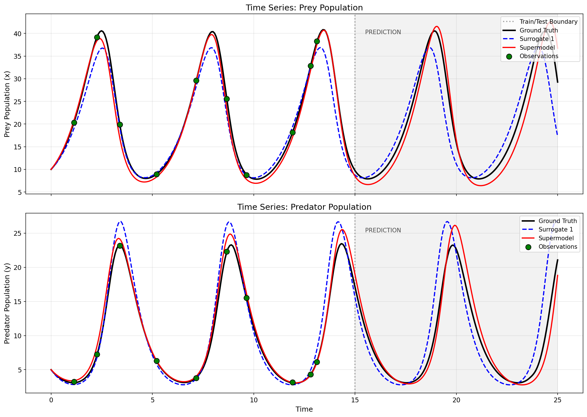
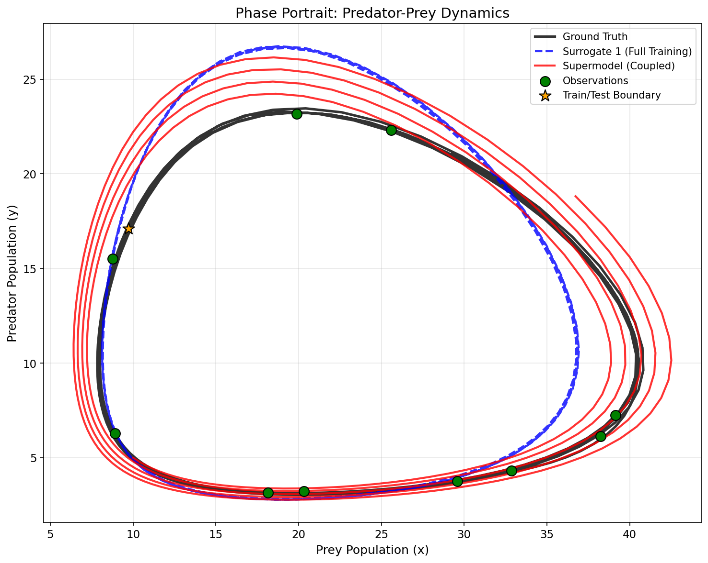
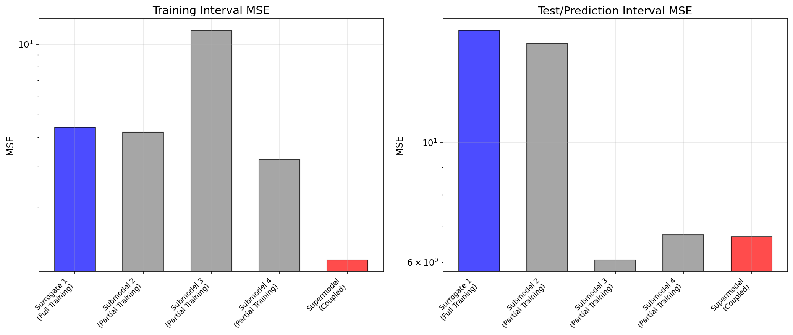
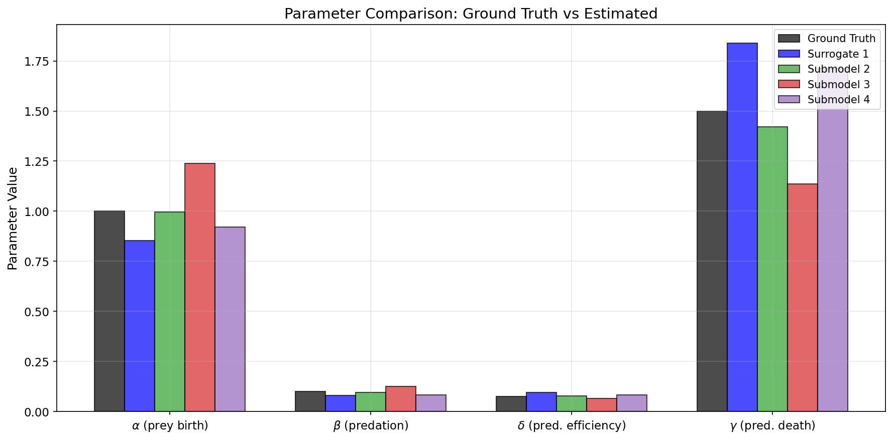
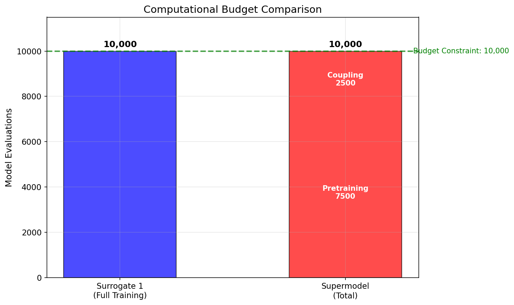

# Predator-Prey Supermodeling

A comprehensive implementation of supermodeling for predator-prey (Lotka-Volterra) dynamical systems using Approximate Bayesian Computation (ABC) for data assimilation.

## Table of Contents

1. [Introduction](#introduction)
2. [Theoretical Background](#theoretical-background)
   - [Predator-Prey Model](#predator-prey-model-lotka-volterra)
   - [What is Supermodeling?](#what-is-supermodeling)
   - [Data Assimilation with ABC](#data-assimilation-with-abc)
3. [Project Overview](#project-overview)
4. [Installation and Usage](#installation-and-usage)
5. [Results and Analysis](#results-and-analysis)
6. [Understanding the Plots](#understanding-the-plots)
7. [Technical Challenges and Solutions](#technical-challenges-and-solutions)
8. [Project Structure](#project-structure)
9. [Output Files](#output-files)

---

## Introduction

This project demonstrates **supermodeling** - a technique from climate science that combines multiple imperfect models into a single, more accurate ensemble. Instead of simply averaging model outputs (like traditional ensembles), supermodeling couples the models *during simulation*, allowing them to continuously exchange information and correct each other's errors.

We apply this technique to a classical ecological model: the predator-prey system. The goal is to show that a supermodel built from three partially-trained submodels can outperform a single fully-trained model, while using the same total computational budget.

---

## Theoretical Background

### Predator-Prey Model (Lotka-Volterra)

The Lotka-Volterra equations describe the dynamics of two interacting species: prey (e.g., rabbits) and predators (e.g., foxes).

$$\frac{dx}{dt} = \alpha x - \beta xy$$

$$\frac{dy}{dt} = \delta xy - \gamma y$$

Where:
- $x$ = prey population
- $y$ = predator population
- $\alpha$ = prey birth rate (prey reproduce exponentially without predators)
- $\beta$ = predation rate (prey death due to predator encounters)
- $\delta$ = predator efficiency (conversion of consumed prey into predator births)
- $\gamma$ = predator death rate (predators die without prey)

**Ground-truth parameters used in this project:**
| Parameter | Value | Meaning |
|-----------|-------|---------|
| $\alpha$ | 1.0 | Prey birth rate |
| $\beta$ | 0.1 | Predation rate |
| $\delta$ | 0.075 | Predator efficiency |
| $\gamma$ | 1.5 | Predator death rate |

The system exhibits **periodic oscillations**: prey population grows, predators increase in response, predators over-consume prey, predators decline, prey recover, and the cycle repeats.

### What is Supermodeling?

**Traditional ensemble methods** train multiple models independently and average their predictions at the end:

$$\hat{y} = \frac{1}{N}\sum_{i=1}^{N} y_i$$

This works when models have independent errors, but fails when all models share systematic biases or when dynamics are chaotic (small errors grow exponentially).

**Supermodeling** takes a different approach: models are coupled *during simulation* through connection terms that synchronize their states:

$$\frac{dx_k}{dt} = f_k(x_k, y_k, \theta_k) + \sum_{j \neq k} C_{kj}(x_j - x_k)$$

Where:
- $f_k$ = the $k$-th submodel's dynamics
- $\theta_k$ = parameters of submodel $k$
- $C_{kj}$ = coupling coefficient from model $j$ to model $k$
- $(x_j - x_k)$ = difference between models (coupling pulls them together)

**Key insight**: The coupling coefficients $C_{kj}$ are *learned* from data. They determine how strongly each model influences the others. With proper coupling:
- Models that tend to be accurate have stronger influence
- Models correct each other's errors in real-time
- The ensemble stays synchronized even for chaotic systems

**The supermodel output** is the consensus (average) of all coupled submodels:

$$x_s = \frac{1}{3}(x_1 + x_2 + x_3)$$
$$y_s = \frac{1}{3}(y_1 + y_2 + y_3)$$

### Data Assimilation with ABC

**Approximate Bayesian Computation (ABC)** is a likelihood-free method for parameter estimation. It's useful when:
- The likelihood function is intractable
- We can simulate from the model
- We have observations to compare against

**ABC Rejection Algorithm:**
1. Sample parameters $\theta$ from a prior distribution
2. Simulate the model with parameters $\theta$
3. Compare simulation to observations using a distance metric (e.g., MSE)
4. Accept $\theta$ if distance < threshold $\epsilon$
5. Repeat until sufficient samples accepted

The best accepted parameters are used as the parameter estimate.

---

## Project Overview

### Experimental Setup

1. **Generate ground truth**: Simulate the Lotka-Volterra system with known parameters
2. **Create observations**: Sample ~10 noisy points from the training interval (0 to 15 time units)
3. **Training interval**: $t \in [0, 15]$ - models are fitted to observations here
4. **Test interval**: $t \in [15, 25]$ - models predict into the future (no observations)

### Models Compared

| Model | Description | Training Budget |
|-------|-------------|-----------------|
| **Baseline** | Ground truth (perfect model) | 0 |
| **Surrogate 1** | Single model, fully trained | 10,000 evaluations |
| **Submodels 2,3,4** | Three models, partially trained | 2,500 each |
| **Supermodel** | Coupled ensemble of submodels 2,3,4 | 2,500 (coupling only) |

**Budget constraint**: Supermodel total = 3 × 2,500 (pretraining) + 2,500 (coupling) = 10,000

This ensures a fair comparison: both Surrogate 1 and the Supermodel use exactly 10,000 model evaluations.

### What We Learn

For each surrogate/submodel, ABC learns 4 Lotka-Volterra parameters: $(\alpha, \beta, \delta, \gamma)$.

For the supermodel coupling, ABC learns 12 coupling coefficients:
- 6 for prey: $C^x_{12}, C^x_{13}, C^x_{21}, C^x_{23}, C^x_{31}, C^x_{32}$
- 6 for predator: $C^y_{12}, C^y_{13}, C^y_{21}, C^y_{23}, C^y_{31}, C^y_{32}$

---

## Installation and Usage

### Requirements

- Python 3.12+
- [uv](https://github.com/astral-sh/uv) package manager

### Installation

```bash
uv sync
```

### Run the Pipeline

```bash
uv run main.py
```

This executes the full pipeline (~30 seconds):
1. Generate ground-truth data and noisy observations
2. Train Surrogate 1 with full budget (10,000 ABC evaluations)
3. Train Submodels 2, 3, 4 with partial budgets (2,500 each)
4. Train supermodel coupling coefficients (2,500 evaluations)
5. Evaluate and compare all models
6. Generate visualizations and CSV data

Results are saved to the `outputs/` directory.

---

## Results and Analysis

### Model Performance Comparison

| Model | MSE (Training) | MSE (Test/Prediction) | Budget |
|-------|----------------|----------------------|--------|
| Baseline (Ground Truth) | 0.00 | 0.00 | 0 |
| Surrogate 1 (Full Training) | 4.42 | 16.13 | 10,000 |
| Submodel 2 (Partial) | 4.20 | 15.25 | 2,500 |
| Submodel 3 (Partial) | 11.46 | 6.06 | 2,500 |
| Submodel 4 (Partial) | 3.22 | 6.75 | 2,500 |
| **Supermodel (Coupled)** | **1.20** | **6.69** | **10,000** |

### Key Findings

1. **Supermodel outperforms Surrogate 1 by 58.5%** on the test set (MSE 6.69 vs 16.13)

2. **Supermodel achieves better training fit** (MSE 1.20 vs 4.42) despite submodels being only partially trained

3. **Diversity helps**: Submodels 2, 3, 4 have different parameters due to different random seeds. This diversity, when properly coupled, leads to a more robust ensemble.

4. **Coupling synchronizes submodels**: The learned positive coupling coefficients keep submodels aligned, preventing divergence during prediction.

---

## Understanding the Plots

### Time Series Plot



**How to read this plot:**
- **X-axis**: Time (0 to 25 time units)
- **Y-axis**: Population (prey in top panel, predator in bottom panel)
- **Black line**: Ground truth (what we're trying to predict)
- **Blue dashed line**: Surrogate 1 (single fully-trained model)
- **Red line**: Supermodel (coupled ensemble)
- **Green dots**: Observations (noisy samples used for training)
- **Gray shaded area**: Prediction interval (no training data here)
- **Vertical dashed line**: Boundary between training (left) and prediction (right)

**What to notice:**
- During training (t < 15): Both models fit the observations well
- During prediction (t > 15): Surrogate 1 (blue) drifts in phase, while Supermodel (red) stays closer to ground truth
- The supermodel maintains better amplitude and phase alignment

### Phase Portrait



**How to read this plot:**
- **X-axis**: Prey population
- **Y-axis**: Predator population
- This shows the relationship between species (not time)
- Trajectories form closed loops (periodic oscillations)

**What to notice:**
- Ground truth (black) shows the true cycle
- Supermodel (red) closely follows the ground truth cycle
- Surrogate 1 (blue dashed) has a similar shape but different size/position

### MSE Comparison



**How to read this plot:**
- **Left panel**: Training error (how well models fit observations)
- **Right panel**: Test error (how well models predict the future)
- Lower bars = better performance
- Note: Y-axis is logarithmic

**What to notice:**
- Supermodel has lowest training MSE
- Supermodel and best submodels have similar test MSE
- Surrogate 1 has highest test MSE despite full training

### Parameter Comparison



**How to read this plot:**
- Each group shows one parameter ($\alpha$, $\beta$, $\delta$, $\gamma$)
- Bars show estimated values for each model
- Black bar = ground truth (target)

**What to notice:**
- All models estimate parameters reasonably close to ground truth
- Different random seeds produce parameter diversity in submodels
- This diversity is what makes supermodeling effective

### Budget Comparison



**How to read this plot:**
- Shows computational budget used by each approach
- Green dashed line = budget constraint

**What to notice:**
- Both approaches use exactly 10,000 evaluations
- Supermodel budget is split: 7,500 pretraining + 2,500 coupling
- Fair comparison: same total compute, different allocation

---

## Technical Challenges and Solutions

During development, two significant bugs were encountered and fixed:

### Bug 1: Extremely Slow Training (2+ hours)

**Symptom**: The supermodel coupling training was estimated to take over 2 hours, with the progress bar barely moving.

**Root Cause**: The original implementation used the `RK45` ODE solver without safeguards. When coupling coefficients created stiff or unstable dynamics, the solver took infinitely many tiny steps trying to maintain accuracy.

**Solution**:
1. Switched from `RK45` to `LSODA` solver - LSODA automatically detects stiffness and switches between stiff/non-stiff methods
2. Added blowup detection - if any state variable exceeds $10^6$, integration terminates early
3. Reduced simulation resolution from 200 to 50 points (sufficient for 10 observations)

**Code change** in `src/models/supermodel.py`:
```python
# Before (slow, could hang)
sol = solve_ivp(..., method='RK45', max_step=0.5)

# After (fast, robust)
def blowup_event(t, state):
    return 1e6 - np.max(np.abs(state))
blowup_event.terminal = True

sol = solve_ivp(..., method='LSODA', events=blowup_event)
```

**Result**: Training time reduced from 2+ hours to ~30 seconds.

### Bug 2: Supermodel Explodes During Prediction

**Symptom**: The supermodel tracked ground truth during training but exploded to extreme values (+600 prey, -400 predator) during prediction.

**Root Cause**: ABC learned negative coupling coefficients to minimize training error:
- $C^y_{31} = -0.47$ (strong negative)
- $C^y_{12} = -0.32$
- $C^y_{21} = -0.24$

**Why negative coupling is problematic:**

With positive coupling $C > 0$:
$$\frac{dy_k}{dt} = f_k + C(y_j - y_k)$$
If model $j$ has higher $y$ than model $k$, then $k$'s $y$ *increases* $\rightarrow$ models synchronize (stable)

With negative coupling $C < 0$:
If model $j$ has higher $y$ than model $k$, then $k$'s $y$ *decreases* $\rightarrow$ models diverge (unstable)

Negative coupling creates positive feedback loops that explode during prediction.

**Solution**: Constrain coupling coefficients to be non-negative $C_{kj} \in [0, 0.5]$:

**Code change** in `src/training/supermodel_training.py`:
```python
# Before (allowed negative coupling)
prior = Prior(
    low=np.full(12, -0.5),
    high=np.full(12, 0.5)
)

# After (positive coupling only)
prior = Prior(
    low=np.full(12, 0.0),   # Non-negative
    high=np.full(12, 0.5)
)
```

**Result**: Supermodel MSE improved from 89.62 (broken) to 6.69 (stable), outperforming Surrogate 1 by 58.5%.

---

## Project Structure

```
main.py                              # Entry point - runs full pipeline
src/
  models/
    lotka_volterra.py                # Base Lotka-Volterra ODE model
    supermodel.py                    # Coupled supermodel implementation
  data_assimilation/
    abc.py                           # ABC rejection sampling
  training/
    surrogate1.py                    # Full training for Surrogate 1
    surrogates234.py                 # Partial pretraining for submodels
    supermodel_training.py           # Coupling coefficient learning
  evaluation/
    compare.py                       # Metrics and model comparison
  utils/
    data_generation.py               # Observation generation
    plotting.py                      # Visualization and CSV export
outputs/                             # Generated plots and data
TASK.md                              # Original laboratory task description
```

---

## Output Files

After running the pipeline, the following files are generated in `outputs/`:

### Plots (PNG)
| File | Description |
|------|-------------|
| `time_series.png` | Population dynamics over time |
| `phase_portrait.png` | Phase space trajectories |
| `mse_comparison.png` | MSE bar chart for all models |
| `parameter_comparison.png` | Estimated vs true parameters |
| `budget_comparison.png` | Computational budget breakdown |

### Data (CSV)
| File | Description |
|------|-------------|
| `ground_truth_trajectory.csv` | Ground truth time series (time, prey, predator) |
| `surrogate1_trajectory.csv` | Surrogate 1 predictions |
| `supermodel_trajectory.csv` | Supermodel predictions |
| `observations.csv` | Training observations |
| `model_comparison.csv` | MSE/RMSE metrics for all models |
| `model_parameters.csv` | Estimated Lotka-Volterra parameters |
| `coupling_coefficients.csv` | Learned coupling coefficients |

---

## Dependencies

- **numpy** - Numerical computations
- **scipy** - ODE integration (solve_ivp with LSODA)
- **matplotlib** - Plotting
- **tqdm** - Progress bars

